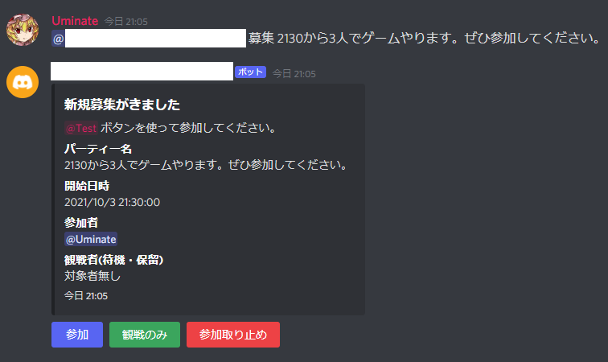
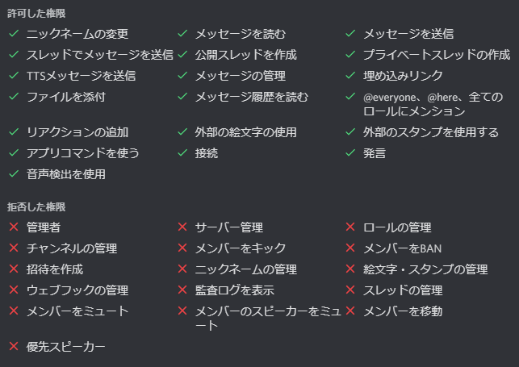

# atodelie-discord-support-bot

Discordでイベント（ゲーム、TRPG）の募集補助を行うbotです。  
イベント募集に掛かる手間（参加人の把握、フォローアップ等）を自動化し、人的負担を軽減することが目的です。  

本botには以下の機能があります。  
- 募集作成機能
    - Discord上からbotにmentionで募集を作成。
    - 期限日時を募集文からある程度自動認識し設定。
- 募集編集／削除機能
    - 募集後に募集文、期限日時の変更が可能。
    - 募集後の取り止めも可能。
- ボタンでの参加形態選択（参加／観戦のみ／辞退）
    - Discord上からボタンを使用し、参加を表明することが可能。
    - 参加した後でも、期限日時までは変更が可能。
- フォローアップ
    - 期限日時の10分前にmentionでメンバーにフォロー。
- 各種文言カスタマイズ機能
    - 募集、参加、辞退等の文言を自由に変更することが可能。
  
- Example


## Usage

初期設定でサポートされているコマンドは次の通りです。    
|#|コマンド文|例|アクション|
| --- | --- | --- | --- |
|1|@(bot名) **募集** 募集文(※1)|@botくん 募集 2100から～を開催しますのでご参加ください。|新規募集を作成。<br>誰でも実行可能。|
|2|@(募集へのメンション) **編集** 募集文(※1)|@botくん 変更 都合により22時からに変更します。|募集内容を変更。<br>募集作成者のみ実行可能。|
|3|@(募集へのメンション) **中止** 募集文(※1)|@botくん 中止 都合により中止します。|募集を中止し削除。<br>募集作成者のみ実行可能。|
|4|@(bot名) **初期設定** @(募集通知先ロール)|@botくん 初期設定 @通知ロール|募集を通知するチャンネルとロールを設定(※2)。|

※1 : 時間文字列(4桁数時、または、～時の構文)を含む募集文。時間文字列は「2100」や「21時」、「21:00」といった形式をサポート。  
※2 : .envの「DISCORD_BOT_ADMIN_USER_ID」に設定したユーザID([確認方法](https://support.discord.com/hc/ja/articles/206346498-%E3%83%A6%E3%83%BC%E3%82%B6%E3%83%BC-%E3%82%B5%E3%83%BC%E3%83%90%E3%83%BC-%E3%83%A1%E3%83%83%E3%82%BB%E3%83%BC%E3%82%B8ID%E3%81%AF%E3%81%A9%E3%81%93%E3%81%A7%E8%A6%8B%E3%81%A4%E3%81%91%E3%82%89%E3%82%8C%E3%82%8B-))ユーザ限定。

上記のコマンド文字列は.envファイルの次の設定値でカスタマイズ可能です。設定はcsv形式で複数定義できます。初期設定でも上記の表以外に、平仮名文字列等がサポートされています。
```bash
DISCORD_COMMAND_NEW_RECRUITMENT='募集,ぼしゅう'
DISCORD_COMMAND_EDIT_RECRUITMENT='編集,へんしゅう,変更,へんこう'
DISCORD_COMMAND_DELETE_RECRUITMENT='中止,ちゅうし,キャンセル'
DISCORD_COMMAND_LIST_RECRUITMENT='リスト,一覧' # 現在未サポート
DISCORD_COMMAND_REGIST_MASTER='初期設定'
```

## Requirements

- node.js 16.x
- server machine (Windows, Linux, ...)

## Installation
インストールの前に、Discord Developer Portalからbotの新規登録を行ってください([参考記事](https://qiita.com/1ntegrale9/items/cb285053f2fa5d0cccdf))。  
ロールに必要な権限が次の通りです。  
  
以下にLinuxでのインストール方法を記します。
```bash
$ git clone https://github.com/kureha/atodelie-discord-support-bot.git
$ cd atodelie-discord-support-bot.git

$ cp -rpv .env.sample .env # create .env file from sample
$ vim .env # please change DISCORD_BOT_TOKEN and DISCORD_BOT_ADMIN_USER_ID

$ npm install
$ node index.js # run
```
可能であれば実行はnode index.jsではなく、systemd等を使用したサービス化をお勧めします。   
以下は/etc/systemd/system以下に配置するファイルのサンプルです。
```bash
[Unit]
Description=atodelie-discord-support-bot
After=syslog.target

[Service]
Type=simple
WorkingDirectory=/opt/atodelie-discord-support-bot.bot/
ExecStart=/usr/local/bin/node /opt/atodelie-discord-support-bot.bot/index.js
KillMode=process
Restart=always
StandardOutput=journal
StandardError=journal
User=PLEASE_CHANGE_THIS_LINE
Group=PLEASE_CHANGE_THIS_LINE

[Install]
WantedBy = multi-user.target
```
Windowsでもインストール手順はほぼ同様です。  
サービス化については方法を省略します。
```cmd
git clone https://github.com/kureha/atodelie-discord-support-bot.git
cd atodelie-discord-support-bot.git

xcopy .env.sample .env
echo メモ帳などで.envファイルを編集。
echo DISCORD_BOT_TOKENとDISCORD_BOT_ADMIN_USER_IDを必ず変更。
pause

npm install
node index.js # run
```

## Maintainer

Kureha Hisame <<kureha@gmail.com>>


