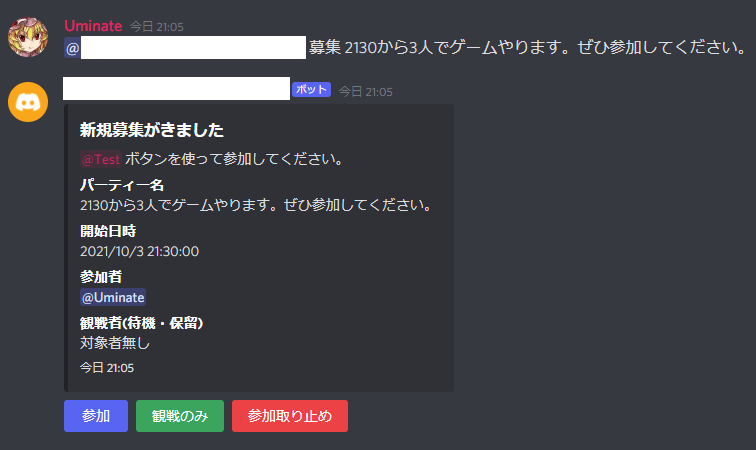

# atodelie-discord-support-bot

Discordでイベント（ゲーム、TRPG）の募集補助を行うbotです。  
イベント募集に掛かる手間（参加人の把握、フォローアップ等）を自動化し、人的負担を軽減することが目的です。  

本botには以下の機能があります。  
- 募集作成機能
    - Discord上からbotにmentionで募集を作成。
    - 期限日時を募集文からある程度自動認識し設定。
- 募集編集／削除機能
    - 募集後に募集文、期限日時の変更が可能。
    - 募集後の取り止めも可能。
- ボタンでの参加形態選択（参加／観戦のみ／辞退）
    - Discord上からボタンを使用し、参加を表明することが可能。
    - 参加した後でも、期限日時までは変更が可能。
- フォローアップ
    - 期限日時の10分前にmentionでメンバーにフォロー。
- 各種文言カスタマイズ機能
    - 募集、参加、辞退等の文言を自由に変更することが可能。
  



## Requirements

- node.js 16.x
- server machine (Windows, Linux, ...)

## Installation

```bash
$ git clone https://github.com/kureha/atodelie-discord-support-bot.git
$ cd atodelie-discord-support-bot.git

$ cp -rpv .env.sample .env # create .env file from sample
$ vim .env # please change DISCORD_BOT_TOKEN and DISCORD_BOT_ADMIN_USER_ID

$ npm install
$ node index.js # run
```

## Maintainer

Kureha Hisame <<kureha@gmail.com>>


